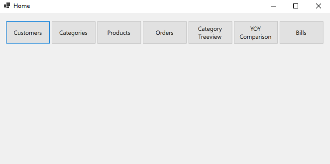

<!-- PROJECT SHIELDS -->
<!--
*** I'm using markdown "reference style" links for readability.
*** Reference links are enclosed in brackets [ ] instead of parentheses ( ).
*** See the bottom of this document for the declaration of the reference variables
*** for contributors-url, forks-url, etc. This is an optional, concise syntax you may use.
*** https://www.markdownguide.org/basic-syntax/#reference-style-links
-->
[![Contributors][contributors-shield]][contributors-url]
[![Forks][forks-shield]][forks-url]
[![Stargazers][stars-shield]][stars-url]
[![Issues][issues-shield]][issues-url]
[![MIT License][license-shield]][license-url]


<!-- PROJECT LOGO -->
<br />

<p align="center">
  <a href="https://github.com/ricardo17coelho/order-management">
    
  </a>

  <h3 align="center">order-management</h3>

</p>


<!-- TABLE OF CONTENTS -->
<details open="open">
  <summary><h2 style="display: inline-block">Table of Contents</h2></summary>
  <ol>
    <li>
      <a href="#about-the-project">About The Project</a>
      <ul>
        <li><a href="#built-with">Built With</a></li>
      </ul>
    </li>
    <li>
      <a href="#getting-started">Getting Started</a>
      <ul>
        <li><a href="#prerequisites">Prerequisites</a></li>
        <li><a href="#installation">Installation</a></li>
      </ul>
    </li>
    <li><a href="#usage">Usage</a></li>
    <li><a href="#roadmap">Roadmap</a></li>
    <li><a href="#contributing">Contributing</a></li>
    <li><a href="#license">License</a></li>
    <li><a href="#contact">Contact</a></li>
  </ol>
</details>


<!-- ABOUT THE PROJECT -->
## About The Project


### Built With

* [MS Visual Studio](https://visualstudio.microsoft.com/de/)
* [MSSQL-Datenbank](https://docs.microsoft.com/de-de/sql/relational-databases/databases/create-a-database?view=sql-server-ver15)


<!-- GETTING STARTED -->

## Getting Started

To get a local copy up and running follow these simple steps.

### Prerequisites

This is an example of how to list things you need to use the software and how to install them.
* MS Visual Studio
* MSSQL-Datenbank

### Installation

1. Clone the repo
   ```sh
   git clone https://github.com/ricardo17coelho/order-management.git
   ```
   
2. Mit MS Visual Studio öffnen
   
3. Update-Database

   ```sh
   pm update-database
   ```


<!-- USAGE EXAMPLES -->
## Usage

Use this space to show useful examples of how a project can be used. Additional screenshots, code examples and demos work well in this space. You may also link to more resources.

_For more examples, please refer to the [Documentation](documentation/documentation.docx)_

## Coverage

https://htmlpreview.github.io/?https://github.com/ricardo17coelho/order-management/blob/main/CodeCoverageReport/summary.html

Command to execude Tests and generate a report.xml:
```
dotnet test --no-build --collect:"XPlat Code Coverage" --verbosity normal ./code -- DataCollectionRunSettings.DataCollectors.DataCollector.Configuration.Format=opencover
```

Command to generate a viewable html:
```
reportgenerator.exe -reports:"code/order-management.tests/TestResults/GENERATED_ID/coverage.opencover.xml" -targetdir:"CodeCoverageReport" -reporttypes:HtmlSummary
```


<!-- ROADMAP -->
## Roadmap

See the [open issues](https://github.com/ricardo17coelho/order-management/issues) for a list of proposed features (and known issues).


<!-- CONTRIBUTING -->
## Contributing

Contributions are what make the open source community such an amazing place to be learn, inspire, and create. Any contributions you make are **greatly appreciated**.

1. Fork the Project
2. Create your Feature Branch (`git checkout -b feature/AmazingFeature`)
3. Commit your Changes (`git commit -m 'Add some AmazingFeature'`)
4. Push to the Branch (`git push origin feature/AmazingFeature`)
5. Open a Pull Request


<!-- LICENSE -->
## License

Distributed under the MIT License. See `LICENSE` for more information.


<!-- CONTACT -->
## Contact

Ricardo Coelho- [contact]([devel@rmorgado.ch](mailto:devel@rmorgado.ch)) 

Raphael Wirth - [contact]([raphi.wirth@gmail.com](mailto:raphi.wirth@gmail.com)) 

Project Link: [https://github.com/ricardo17coelho/order-management](https://github.com/ricardo17coelho/order-management)


<!-- MARKDOWN LINKS & IMAGES -->
<!-- https://www.markdownguide.org/basic-syntax/#reference-style-links -->
[contributors-shield]: https://img.shields.io/github/contributors/ricardo17coelho/order-management.svg?style=for-the-badge
[contributors-url]:  https://img.shields.io/github/contributors/ricardo17coelho/order-management.svg?style=for-the-badge
[forks-shield]: https://img.shields.io/github/forks/ricardo17coelho/order-management.svg?style=for-the-badge
[forks-url]: https://github.com/ricardo17coelho/order-management/network/members
[stars-shield]: https://img.shields.io/github/stars/ricardo17coelho/order-management.svg?style=for-the-badge
[stars-url]: https://github.com/ricardo17coelho/order-management/stargazers
[issues-shield]: https://img.shields.io/github/issues/ricardo17coelho/order-management.svg?style=for-the-badge
[issues-url]: https://github.com/ricardo17coelho/order-management/issues
[license-shield]: https://img.shields.io/github/license/ricardo17coelho/order-management.svg?style=for-the-badge
[license-url]: https://github.com/ricardo17coelho/order-management/blob/master/LICENSE.txt