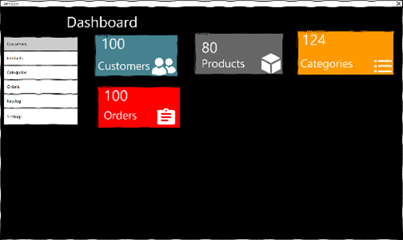
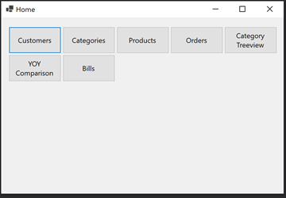
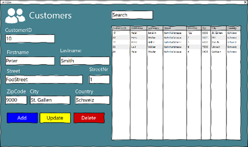
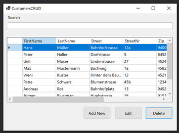
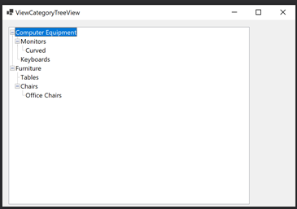
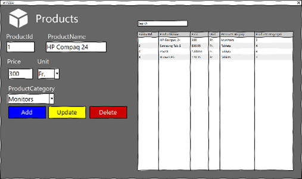
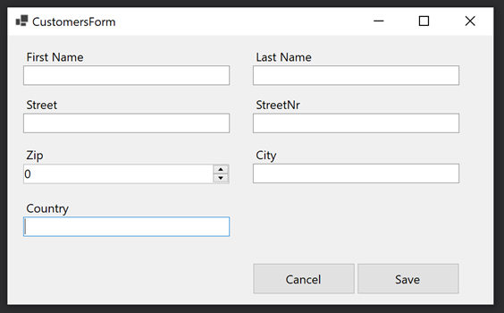

# UI

## Mockups vs Endergebnis

Warum abweicht unser Endprodukt von erstellten Mockups?

Am Anfang wollten wir ein einfaches Design für all die Views gestalten und mit Hilfe von verschiedener Farbe, die «views» unterscheiden.

Jedoch haben wir schnell gemerkt, dass WindowsForms sehr limitiert ist.

Sowohl ich als auch Raphael sind daran gewohnt mit guten Frameworks in WEB Bereich zu arbeiten, welche uns viele Möglichkeiten anbieten und deswegen, dachten wir dass wir hier auch umsetzen könnten, aber das war nicht wirklich möglich.

### Dashboard

#### Vor-/Nachteile

Vorteile       | Nachteile
-------------- | -----------------------
Schnellzugriff | Mehrmals gleiche Aktion
Zähler         | Responsive

Mockup                                                 | Result
------------------------------------------------------ | ------------------------------------------------------
 | 

### Customers

#### Vor-/Nachteile

Vorteile                  | Nachteile
------------------------- | ---------------
Keine Zusätzliche Fenster | Unübersichtlich
...                       | Responsive

Mockup                                                 | Result
------------------------------------------------------ | ------------------------------------------------------
 | 

### Categories

#### Vor-/Nachteile

Vorteile                  | Nachteile
------------------------- | ---------------
Keine Zusätzliche Fenster | Unübersichtlich
...                       | Responsive

Mockup                                                   | Result
-------------------------------------------------------- | --------------------------------------------------------
 | 

### Catalog

#### Vor-/Nachteile

Vorteile             | Nachteile
-------------------- | ---------
Zugriff auf Produkte |

Mockup                                             | Result
-------------------------------------------------- | --------------------------------------------------
 | 

### Orders

#### Vor-/Nachteile

Vorteile                  | Nachteile
------------------------- | ---------------
Keine Zusätzliche Fenster | Unübersichtlich
...                       | Responsive

Mockup                                           | Result
------------------------------------------------ | ------------------------------------------------
 | 

### Products

#### Vor-/Nachteile

Vorteile                  | Nachteile
------------------------- | ---------------
Keine Zusätzliche Fenster | Unübersichtlich
..                        | Responsive

Mockup                                               | Result
---------------------------------------------------- | ----------------------------------------------------
 | 

### Settings

#### Vor-/Nachteile

Vorteile                           | Nachteile
---------------------------------- | ---------
Diverse Einstellung auf eine Seite |

Mockup                                               | Result
---------------------------------------------------- | ------
 | -

## Modal Forms

Wir haben uns am Angang entschieden, alle Grids + Formulare auf ein Panel darzustellen.

Im Verlauf von der Entwicklung haben wir nun gemerkt, dass das nicht so wirklich übersichtlich ist.

Deswegen haben wir uns dann entschieden, all die Formulare in einer separaten Modal Fenster anzuzeigen.

Somit erreichen wir ein besseres Design für unsere Grid und die ADD und DELETE Operationen, können sauber über dieses Modal Dialog gelöst werden.

Beim Klicken auf «Add» wird das Formular gelöscht und eine neuen Datensatz kann erfasst werden.

Wenn 1 Datensatz im Grid ausgewählt ist, dann kann man auf «Edit» Button drücken, das Modal wird geöffnet und die Felder werden mit der ausgewählte Datensatz gefüllt.

Beim Speichern wird dann beachtet, ob die Datensatz bereits ein ID hat oder nicht.

Falls ja, werden die Felder in der DB geändert, falls nicht, wird eine neue Datensatz in der DB angelegt

Add Mode                                                           | Edi Mode
------------------------------------------------------------------ | ------------------------------------------------------------------
     | 
 | 
   | 
         | 
