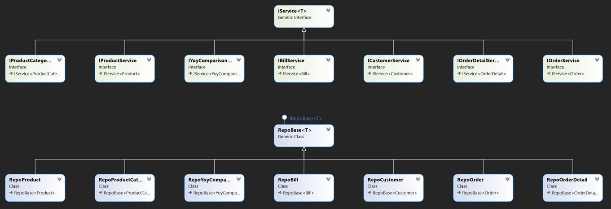
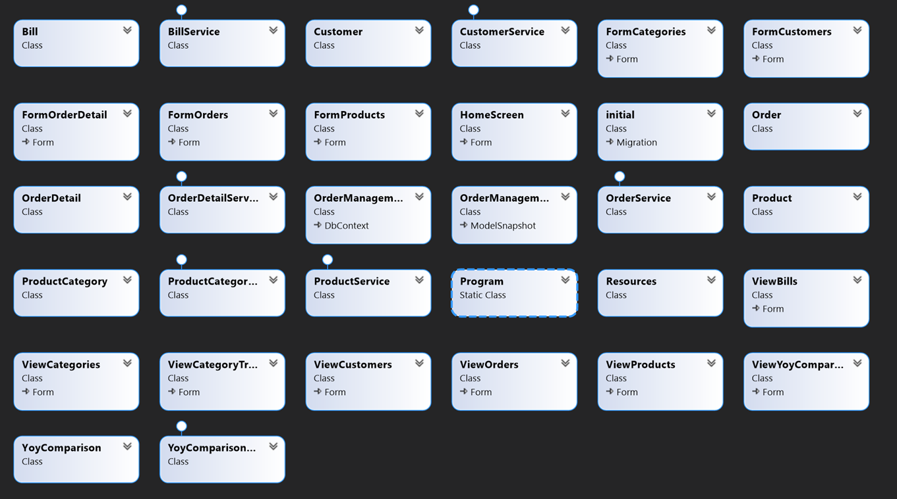
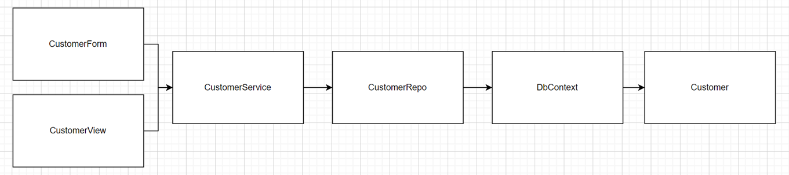

# 05 Architektur





## Beispiel Customer



##	Forms
Forms sind Formulare, welche Textfelder enthalten, wo der User Daten eingeben kann. Diese Daten werden dann schlussendlich auf der Datenbank abgespeichert.
5.1.2	Views
Auf den Views befindet sich jeweils lediglich ein Data-Grid-View welches Daten veranschaulicht.  
5.1.3	Services
Für jedes Entity gibt es einen dazugehörigen Service. Diese bilden jeweils die Verbindung zum Repo ab. Dort drin gibt es jeweils Methoden wie z.B.: 
•	GetAll()
•	GetByName(string name)
•	Add(Entity entity)
•	Delete(Entity entity)
•	Etc.
##	Repos
Die Repos stellen die Verbindung zur DB bzw. zum Context dar.
##	DB-Entities
Zuletzt findet man die DB-Entities, welche so auch im ERM wiederzufinden sind.
##	Ausnahme
Folgende Klasse ist eine Ausnahme und die findet man so nicht in der Datenbank.
•	YoyComparison
In der Methode OnModelCreating() im DbContext wurde definiert, dass für diese Klasse keine Tabelle erzeugt werden soll:
```
modelBuilder.Entity<YoyComparison>().HasNoKey().ToView(null);
```
Diese Klasse wird lediglich als «Query-Objekt» verwendet. D.h. Diese Objekte werden nicht in der Datenbank gespeichert, aber wir benötigen sie als Objektstruktur für gewisse Queries und für die Darstellung im ViewYoyComparison.
