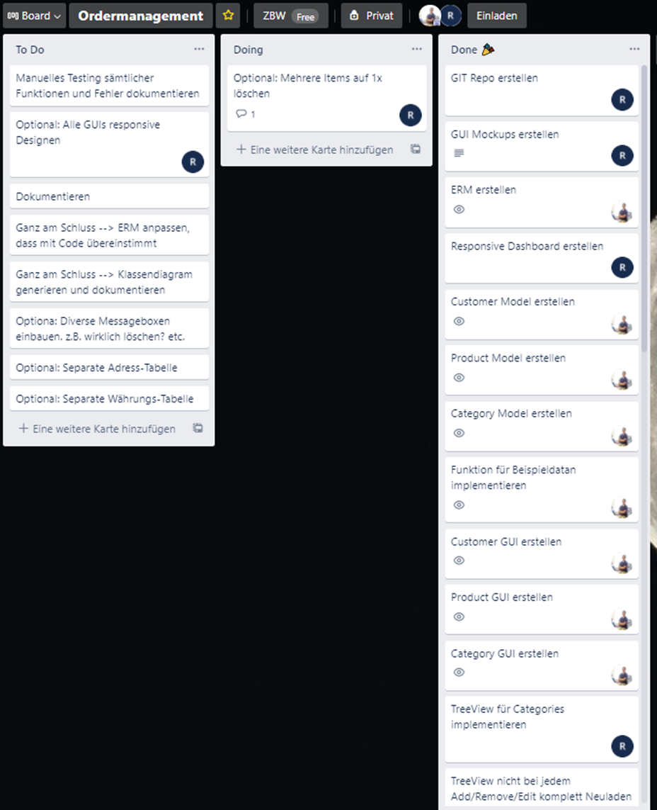

# Unser Vorgehen

## Sourcecode Versionierung

Uns war von Anfang an klar, dass wir den Sourcecode mit Git auf Github verwalten wollten.

## Kanban

Als zusätzliche Hilfe für die Übersicht der Tasks verwendeten wir ein Kanban-Board auf www.trello.com. Anfangs definierten wir einige Tasks und teilten sie einander zu.

Die ersten Tasks waren:

- Ricardo: GIT Repo erstellen
- Ricardo: GUI Mockups erstellen
- Raphael: ERM erstellen
- Ricardo: Dashboard (Homescreen) erstellen
- Raphael: Sämtliche Entity Models erstellen

Danach erstellten wir immer weitere Tasks, priorisierten sie und teilten sie einander zu. Dies ist nur ein kleiner Ausschnitt von unserem Kanban-Board:

